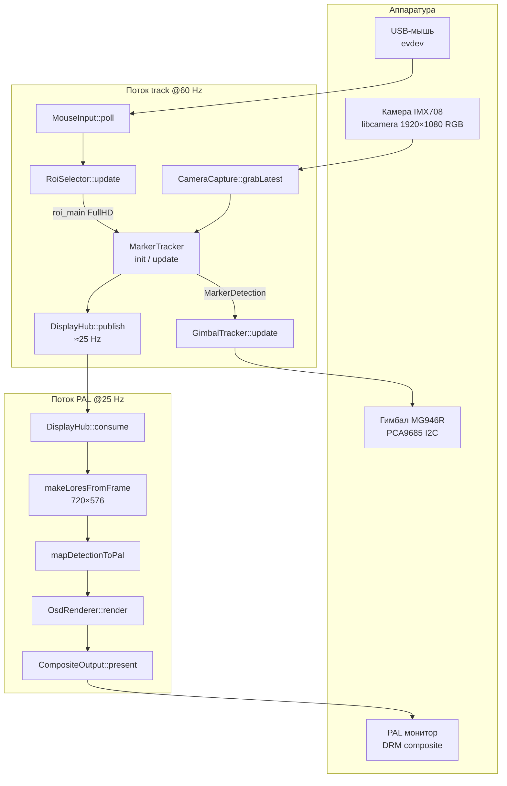
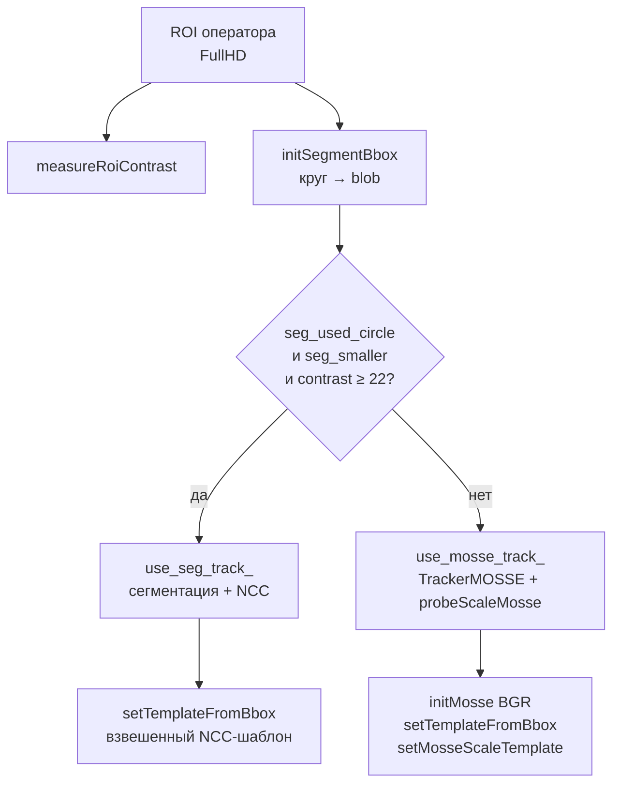
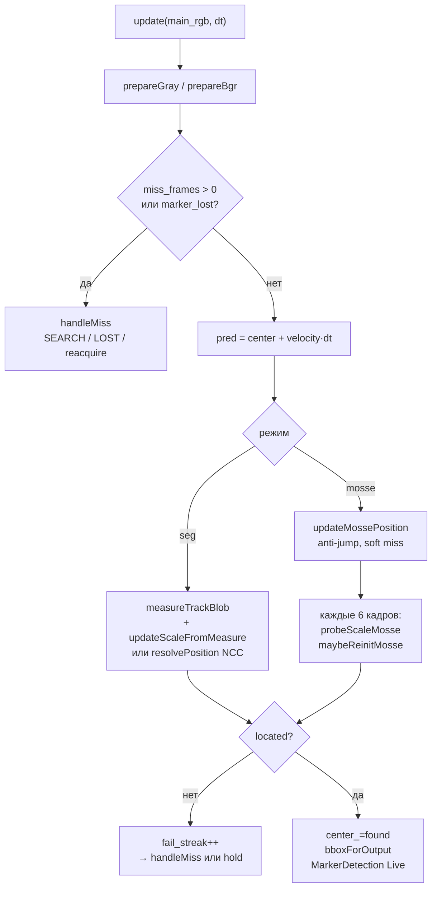
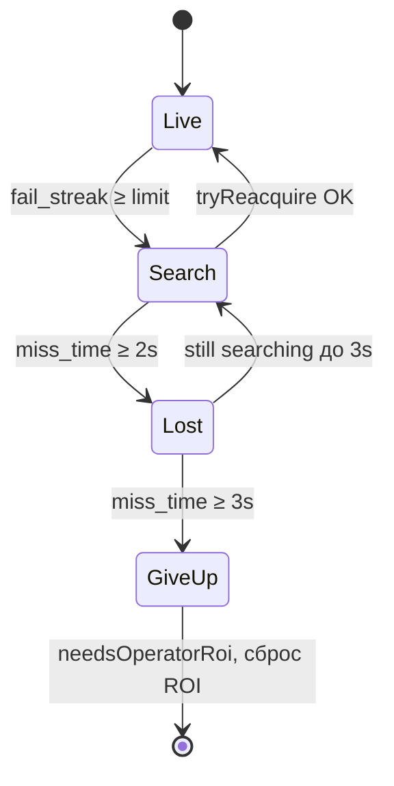

# Описание ПО `electronic_pilot_bench` (текущая версия)

**Дата:** 2026-07-06  
**Платформа:** Raspberry Pi 5, Camera Module 3 (IMX708), PAL composite (J7), опционально PCA9685 + гимбал MG946R  
**Исполняемый файл:** `build/electronic_pilot_bench`  
**Точка восстановления кода:** git tag `epilot-marker-seg-template-2026-07-03` (до гибрида MOSSE); актуальная версия — рабочая копия с гибридным `MarkerTracker`.

---

## 1. Назначение

Стенд этапа 1 «электронный пилот»: оператор на PAL-мониторе (720×576) выделяет мышью объект в кадре; программа **захватывает и сопровождает метку** в потоке FullHD (1920×1080 @60 Hz), выводит рамку и телеметрию на PAL @25 Hz, при наличии железа **поворачивает гимбал** по ошибке положения метки.

SBUS, RP2040 и полётник в этой версии **не участвуют**.

---

## 2. Архитектура и потоки данных

### 2.1. Два потока выполнения

| Поток | Частота | Задачи |
|-------|---------|--------|
| **main (track)** | до 60 Hz | камера, ROI, `MarkerTracker`, гимбал, публикация в `DisplayHub` |
| **pal_thread** | 25 Hz | чтение снимка из `DisplayHub`, downscale, OSD, composite |

Трекинг всегда идёт по **FullHD RGB**; PAL — только отображение (без повторного трекинга на 720×576).

### 2.2. Блок-схема верхнего уровня

### 2.3. Координатные системы

| Система | Размер | Использование |
|---------|--------|---------------|
| **main / FullHD** | 1920×1080 | трекинг, `MarkerDetection.bbox`, ex/ey |
| **lores / PAL** | 720×576 | мышь, OSD, composite |
| Преобразование | `RoiSelector::loresToMain`, `mapMainRectToPal` | линейный масштаб по осям |

Центр кадра FullHD: `(960, 540)`.  
`ex = center_x - 960`, `ey = center_y - 540` (пиксели).

---

## 3. Структуры данных (общие)

### 3.1. `MarkerDetection` (`track_result.h`)

| Поле | Тип | Описание |
|------|-----|----------|
| `valid` | `bool` | Результат трекера осмыслен (режим не `None`) |
| `live` | `bool` | Трекер активен (в т.ч. SEARCH) |
| `capturing` | `bool` | Метка считается захваченной → **красная** рамка OSD |
| `track` | `MarkerTrackMode` | `None`, `Live`, `Predicted`, `Lost` |
| `ex`, `ey` | `double` | Смещение центра метки от центра кадра, px |
| `bbox` | `cv::Rect` | Рамка в FullHD |
| `confidence` | `float` | 0…1, от NCC / эвристик |

### 3.2. `MarkerTrackMode` — конечный автомат сопровождения

| Режим | OSD `telem.mode` | `capturing` | Поведение |
|-------|------------------|-------------|-----------|
| `Live` | TRACK | true | Нормальное сопровождение |
| `Predicted` | SEARCH | false | Потеря кадра; поиск / удержание последней позиции ≤ `kTrackReacquireTimeoutSec` (2 с) |
| `Lost` | LOST | false | Таймаут; баннер «Потеря метки» 3 с; после `kTrackSearchGiveUpSec` (3 с) — сброс ROI |
| `None` | WAIT ROI | false | ROI не задан или трекер сброшен |

### 3.3. `DisplaySnapshot` (`display_hub.h`)

Публикуется track-потоком, потребляется PAL-потоком:

| Поле | Тип | Назначение |
|------|-----|------------|
| `seq` | `uint64_t` | Номер кадра камеры |
| `main_rgb` | `cv::Mat` | Копия FullHD RGB для downscale |
| `det` | `MarkerDetection` | Результат трекера |
| `telem` | `OsdTelemetry` | Режим, углы гимбала, баннер |
| `roi_ui` | `RoiUiState` | Курсор, рамка выделения |
| `tracking_active` | `bool` | Трекер активен и `capturing` |
| `track_center` | `cv::Point2f` | Центр bbox |
| `init_bbox_size` | `cv::Size` | Базовый размер метки после init |

---

## 4. Модули и функции

### 4.1. `main.cpp`

| Функция / блок | Вход | Выход | Описание |
|----------------|------|-------|----------|
| `main()` | — | `int` exit code | Инициализация подсистем, главный цикл track, запуск `pal_thread` |
| Главный цикл | `CameraFrame`, `dt_sec` | публикация в `DisplayHub` | grab → ROI → init/update трекера → гимбал → snapshot |
| `pal_thread` | `DisplayHub` | PAL кадр на монитор | consume → lores → OSD → composite |

**Логика режимов в main:** при новом ROI → `marker.init()`; при `needsOperatorRoi()` → сброс ROI; при `Lost` → баннер; `GimbalTracker` получает `det` каждый кадр track.

---

### 4.2. `CameraCapture` (`camera_capture.cpp/h`)

| Метод | Вход | Выход | Описание |
|-------|------|-------|----------|
| `open()` | — | `bool` | libcamera: main 1920×1080 RGB888 (или NV12), AF continuous |
| `grabLatest(out, timeout_ms)` | `timeout_ms` | `bool`, `CameraFrame` | Последний кадр из triple-buffer |
| `ensureMainBgr(frame)` | `CameraFrame` | BGR в `frame.main_bgr` | Конверсия RGB→BGR при необходимости |
| `makeLoresFromFrame(frame)` | `CameraFrame` | `cv::Mat` 720×576 BGR | Downscale для PAL |

**`CameraFrame`:** `main_rgb`, `main_y`/`main_uv` (NV12), `main_bgr`, `seq`.

---

### 4.3. `MouseInput` / `RoiSelector`

#### `MouseInput`

| Метод | Вход | Выход |
|-------|------|-------|
| `open()` | — | `bool` — `/dev/input/event*` |
| `poll()` | — | обновляет `cursorX/Y`, флаги кнопок |
| `clearEdges()` | — | сброс `leftPressed/Released` |

#### `RoiSelector`

| Метод | Вход | Выход |
|-------|------|-------|
| `update(mouse, main_w, main_h)` | состояние мыши | `roi_main_` FullHD |
| `trackRoiMain()` | — | `cv::Rect` — ROI для `MarkerTracker::init` |
| `clearRoi()` | — | сброс выделения (ПКМ) |
| `ui()` | — | `RoiUiState` для OSD |

**Правила:** ЛКМ — протягивание рамки на PAL; мин. сторона `kRoiMinSelectSidePx` (24); ПКМ — сброс. ROI пересчитывается в FullHD линейным масштабом.

---

### 4.4. `DisplayHub`

| Метод | Вход | Выход |
|-------|------|-------|
| `publish(main_rgb, seq, now, meta)` | кадр + метаданные | `bool` — true ≈ раз в 1/25 с |
| `consume(out)` | — | `bool`, `DisplaySnapshot` |

Triple-buffer (3 слота), rate-limit публикации = `kLoresFps` (25 Hz).

---

### 4.5. `coord_map` / `OsdRenderer` / `CompositeOutput`

| Функция | Вход | Выход |
|---------|------|-------|
| `mapMainRectToPal(rect, …)` | `cv::Rect` FullHD | `cv::Rect` PAL |
| `mapDetectionToPal(det, …)` | `MarkerDetection` | `PalMarkerOverlay` |
| `OsdRenderer::render` | PAL BGR, det, overlay, telem, roi_ui | рисует рамку, курсор, текст, баннер потери |
| `CompositeOutput::present` | 720×576 BGR | вывод DRM на Composite-1 |

---

### 4.6. `GimbalTracker` / `ServoGimbal` / `Pid`

| Метод | Вход | Выход |
|-------|------|-------|
| `GimbalTracker::update(det, dt_sec)` | `MarkerDetection`, `dt` | `GimbalState` {pan_deg, tilt_deg, tracking} |
| `ServoGimbal::setAnglesDeg` | pan, tilt ±90° | PWM на PCA9685 |
| `Pid::update(error, dt)` | ошибка px | шаг угла, ограничен `kPan/TiltPidMaxStepDeg` |

Гимбал работает при любом `det.valid`; при отсутствии PCA9685 — программный режим (углы в телеметрии).

---

## 5. `MarkerTracker` — захват и сопровождение метки

**Файлы:** `marker_tracker.cpp/h`, параметры — `config.h`.

### 5.1. Публичный API

| Метод | Вход | Выход | Описание |
|-------|------|-------|----------|
| `init(main_rgb, roi_main)` | FullHD RGB, ROI оператора | `bool` | Сброс состояния, выбор режима (seg/MOSSE), init шаблонов |
| `update(main_rgb, dt_sec)` | кадр, Δt | `MarkerDetection` | Один шаг сопровождения |
| `reset()` | — | — | Полный сброс |
| `active()` | — | `bool` | Трекер инициализирован |
| `needsOperatorRoi()` | — | `bool` | `search_gave_up_` — нужен новый ROI |
| `initBboxSize()` | — | `cv::Size` | Базовый размер объекта |

### 5.2. Выбор режима при `init` (гибрид)

| Режим | Условие | Типичный объект |
|-------|---------|-----------------|
| **Segment** (`use_seg_track_`) | Найден **тёмный круг** (circularity), bbox меньше ROI, контраст ≥ `kMinContrastForSeg` (22) | Чёрный круг на белом |
| **MOSSE** (`use_mosse_track_`) | Иначе | Ухо, кожа, низкий контраст |

При segment-init: центр и размер уточняются сегментом; печать `bench: segment init …`.  
При MOSSE-init: весь ROI → окно MOSSE; печать `bench: mosse init … contrast=…`.

### 5.3. Внутреннее состояние трекера (ключевые переменные)

| Переменная | Тип | Смысл |
|------------|-----|-------|
| `center_`, `prev_center_`, `velocity_` | `cv::Point2f` | Положение и скорость (EMA `kVelocityEmaAlpha`) |
| `anchor_center_` | `cv::Point2f` | Центр на init (lock первые N кадров для seg) |
| `init_bbox_size_`, `object_size_` | `cv::Size` | Базовый размер bbox (фиксирован после init) |
| `scale_` | `float` | Масштаб 0.25…4.5× от `init_bbox_size_` |
| `mosse_bbox_` | `cv::Rect` | Внутреннее окно MOSSE (отдельно от `scale_` на OSD) |
| `mosse_scale_` | `float` | Масштаб при последнем re-init MOSSE |
| `template_gray_`, `weight_`, `weight_sqrt_` | `cv::Mat` | Взвешенный NCC-шаблон (float, Gaussian) |
| `mosse_scale_gray_` | `cv::Mat` | Gray-патч ROI для `probeScaleMosse` |
| `fail_streak_` | `int` | Счётчик неудачных кадров до SEARCH |
| `miss_*` | — | Состояние эпизода потери |

### 5.4. Алгоритм `update` — общая схема

**Предсказание:** `pred = center_ + velocity_ * dt_sec` — опорная точка для seg и anti-jump MOSSE.

---

### 5.5. Режим Segment — функции

| Функция | Вход | Выход | Назначение |
|---------|------|-------|------------|
| `measureRoiContrast` | gray, ROI | `float` | Оценка контраста (stddev + edge) |
| `initSegmentBbox` | gray, ROI, center | `seg_bbox`, `used_circle` | Круг (контуры) или тёмный blob (Otsu) |
| `segmentDarkCircle` | gray, zone, prefer | `cv::Rect` | Тёмный круг по circularity ≥ 0.55 |
| `segmentDarkBlob` | gray, zone, prefer | `cv::Rect` | Otsu / adaptive threshold + CC |
| `measureTrackBlob` | gray, hint, zone_factor | center, size | Blob в зоне вокруг pred |
| `updateScaleFromMeasure` | measured size | обновляет `scale_` | Плавное масштабирование с ограничениями |
| `locateWeighted` | gray, hint, window | center, response | `matchTemplate` TM_CCOEFF_NORMED с Gaussian-весами |
| `resolvePosition` | gray, pred | center, response | Peak vs pred, anti-latch |
| `responseWeightedAt` | gray, center | NCC response | Верификация в точке |
| `probeScaleNcc` | gray, center | меняет `scale_` | Triplet ±10% (для seg fallback) |

**Трек @60 Hz (segment):**
1. В зоне `kSegTrackZoneFactor` × текущий bbox ищется blob.
2. Если размер и NCC OK — обновляются центр и `scale_`.
3. Иначе — `resolvePosition` (NCC-поиск вокруг pred).
4. Первые `kCenterLockFrames` (10) — удержание `anchor_center_`.

---

### 5.6. Режим MOSSE — функции

| Функция | Вход | Выход | Назначение |
|---------|------|-------|------------|
| `initMosse` | main_rgb, ROI | `bool` | `cv::legacy::TrackerMOSSE::init` на BGR |
| `updateMossePosition` | — | center | `mosse_tracker_->update`; обновляет `mosse_bbox_` |
| `probeScaleMosse` | center | меняет `scale_` | Multi-scale `matchTemplate` в окне 2×, порог 0.12 |
| `maybeReinitMosse` | prev_scale | — | Re-init MOSSE при \|Δscale\| ≥ 0.15 |
| `setMosseScaleTemplate` | gray, ROI | `mosse_scale_gray_` | Шаблон для оценки масштаба |
| `bboxForOutput` | — | `cv::Rect` | Центр MOSSE + размер × (`scale_/mosse_scale_`) |

**Трек @60 Hz (MOSSE):**
1. `updateMossePosition` — позиция из корреляционного фильтра (окно **не** масштабируется каждый кадр).
2. Если скачок центра > `kMosseMaxCenterJumpFactor` × размер окна — отклонение, re-init MOSSE на pred.
3. При сбое MOSSE до 12 кадров — центр из последнего `mosse_bbox_`.
4. Каждые 6 кадров — `probeScaleMosse` (масштаб OSD), при изменении — `maybeReinitMosse`.
5. `fail_streak` лимит — `kMosseFailLimit` (35).

**Разделение позиции и масштаба:** MOSSE держит **позицию** в фиксированном окне; **размер рамки на OSD** задаёт `scale_` относительно `init_bbox_size_`.

---

### 5.7. Потеря и повторный захват

| Функция | Вход | Выход |
|---------|------|-------|
| `handleMiss` | dt, frame_center | `MarkerDetection` Predicted/Lost |
| `tryReacquire` | frame_center | seg: blob+NCC; MOSSE: `locateWeighted` + re-init MOSSE |
| `frozenMissBbox` | — | bbox на `miss_origin_` + `miss_scale_` |
| `makeLiveHoldOutput` | frame_center | Live с последним center при кратком сбое |

| Таймаут | Значение | Эффект |
|---------|----------|--------|
| `kTrackReacquireTimeoutSec` | 2.0 с | После — `Lost`, баннер |
| `kTrackSearchGiveUpSec` | 3.0 с | `search_gave_up_`, сброс ROI |

---

## 6. Перечень исходных файлов

| Файл | Роль |
|------|------|
| `main.cpp` | Точка входа, потоки |
| `marker_tracker.cpp/h` | **Захват и сопровождение метки** |
| `track_result.h` | `MarkerDetection`, `MarkerTrackMode` |
| `config.h` | Все константы |
| `camera_capture.cpp/h` | libcamera |
| `display_hub.cpp/h` | Triple-buffer track→PAL |
| `coord_map.cpp/h` | FullHD ↔ PAL |
| `roi_selector.cpp/h` | ROI мышью |
| `mouse_input.cpp/h` | evdev |
| `osd_renderer.cpp/h` | OSD |
| `composite_out.cpp/h` | DRM PAL |
| `gimbal_tracker.cpp/h` | PID → гимбал |
| `servo_gimbal.cpp/h`, `pca9685.cpp/h` | I2C PWM |
| `pid.h` | PID-регулятор |
| `CMakeLists.txt` | Сборка (OpenCV + tracking + libcamera + libdrm) |

---

## 7. Ключевые константы трекинга (`config.h`)

| Константа | Значение | Назначение |
|-----------|----------|------------|
| `kMinContrastForSeg` | 22 | Порог segment vs MOSSE |
| `kScaleMinRatio` / `kScaleMaxRatio` | 0.25 / 4.5 | Диапазон масштаба |
| `kBboxMaxFrameSideRatio` | 0.42 | Потолок рамки (% кадра) |
| `kTrackMinResponse` | 0.32 | NCC seg |
| `kTrackMinResponseTemplate` | 0.20 | NCC MOSSE reacquire |
| `kMosseScaleMinResponse` | 0.12 | matchTemplate для масштаба MOSSE |
| `kScaleProbeEveryNFrames` | 6 | Период probe масштаба |
| `kVerifyFailToSearch` | 18 | seg: кадров до SEARCH |
| `kMosseFailLimit` | 35 | MOSSE: кадров до SEARCH |
| `kMosseSoftFailFrames` | 12 | MOSSE: удержание без update |
| `kVelocityEmaAlpha` | 0.35 | Сглаживание скорости |

---

## 8. Логи и диагностика

| Сообщение | Значение |
|-----------|----------|
| `bench: segment init WxH … contrast=` | Режим сегментации, размер после init |
| `bench: mosse init WxH contrast=` | Режим MOSSE |
| `bench: mosse track scale= … box= … center=` | Раз в ~1 с в MOSSE-режиме |
| `bench: marker lost (T s)` | Переход в LOST |
| `bench: search gave up …` | Нужен новый ROI |
| `bench: pal=… track=… cap=… trk=…` | Раз в секунду: PAL/track счётчики, режим |

---

## 9. Ограничения текущей версии

- Трекинг — **изотропный масштаб** (один коэффициент), без учёта поворота.
- Segment только для **круглых** тёмных объектов; произвольные контрастные blob не включают seg.
- MOSSE может цепляться за текстуру при резких скачках; есть anti-jump, требует настройки.
- Гимбал опционален; без PCA9685 углы только в OSD.
- Потеря/re-acquire — эвристики; нештатные сценарии — область дальнейшей доработки.

---

## 10. Связанные документы

- `README.md` — сборка и запуск на Pi  
- `TRACKING_ALGORITHM_SPEC.md` — целевой алгоритм vs реализация  
- `deploy-to-pi.ps1`, `pi-ssh-common.ps1` — деплой на `pilot@192.168.1.100`
